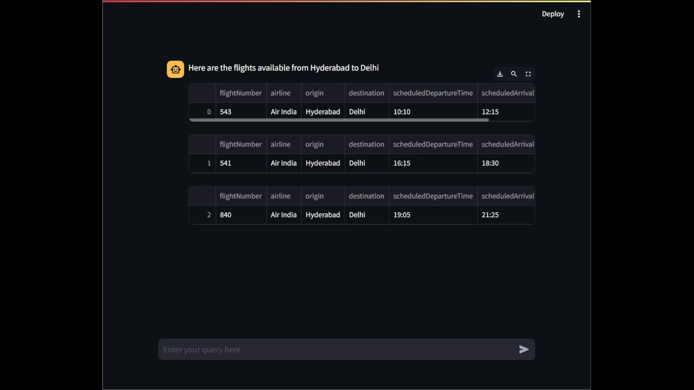
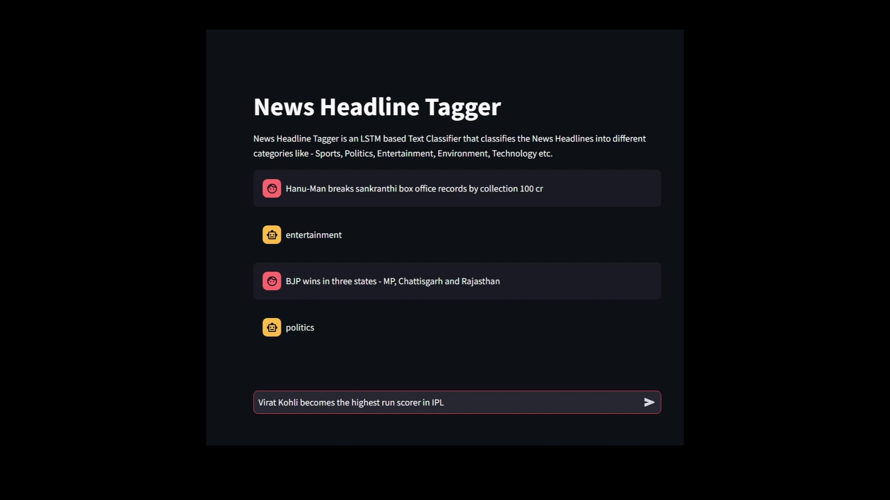
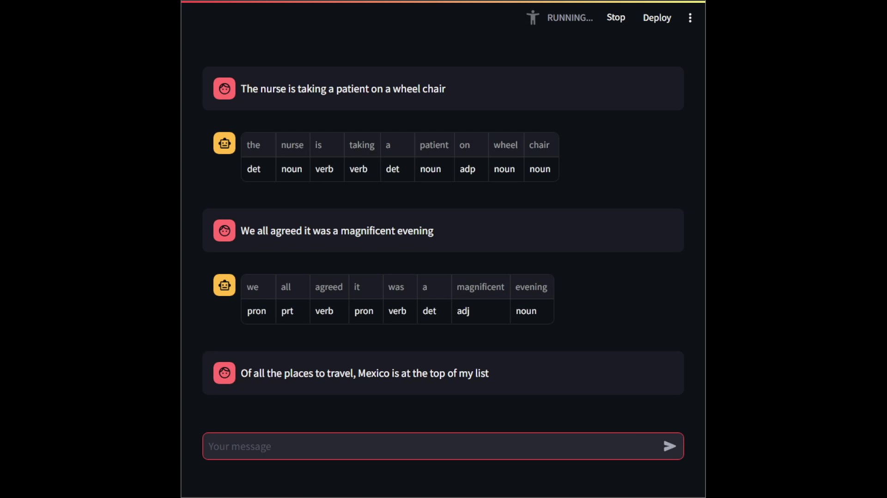

# NLP-Projects

 

  
Table of Contents

  <ol>
    <li>
      <a href="#customer-support-chatbot">Customer Support Chatbot</a>
    </li>
    <li>
      <a href="#news-headline-tagger">News Headline Tagger</a>
    </li>
    <li>
      <a href="#parts-of-speech-tagger">Parts Of Speech Tagger</a>
    </li>
    <li>
      <a href="#python-code-generator">Python Code Generator</a>
    </li>
    <li>
      <a href="#movie-synopsis-search">Movie Synopsis Search</a>
    </li>
  </ol>

 

## Airline Customer Support Chatbot

`Click Image -> Repo`

### About The Project

This is a `Chatbot` built for answering Airline FAQs and Enquiries using `Prompt Engineering`. 

### Built With

![langchain] ![streamlit] ![tensorflow]

 

## News Headline Tagger

`Click Image -> Repo`

### About The Project

This is an `LSTM` based `Deep Learning` model that segregates News Headlines into specific categories like Sports, Entertainment, Politics etc.

### Built With

![tensorflow] ![streamlit] ![python]

 

## Parts Of Speech Tagger

`Click Image -> Repo`

### About The Project

Parts of Speech Tagger is a Streamlit Application that takes a Sentence as input and generates a POS(parts of speech) Tag for each word/token in the sentence. The model uses LSTM architechture to generate the pos tags.

### Built With

![tensorflow] ![scikitlearn] ![streamlit]

 

[Django]:https://img.shields.io/badge/Django-black?style=for-the-badge&logo=django
[HTML]:https://img.shields.io/badge/HTML-grey?style=for-the-badge&logo=html5
[CSS]:https://img.shields.io/badge/CSS-blue?style=for-the-badge&logo=css3
[Bootstrap]:https://img.shields.io/badge/Bootstrap-563D7C?style=for-the-badge&logo=bootstrap&logoColor=white
[React.js]: https://img.shields.io/badge/React-20232A?style=for-the-badge&logo=react&logoColor=61DAFB
[scikitlearn]:https://img.shields.io/badge/Scikit--Learn-white?style=for-the-badge&logo=scikit-learn
[tensorflow]:https://img.shields.io/badge/Tensorflow-425066?style=for-the-badge&logo=tensorflow
[langchain]:https://img.shields.io/badge/Langchain-black?style=for-the-badge&logo=openai&logoColor=white
[streamlit]:https://img.shields.io/badge/Streamlit-red?style=for-the-badge&logo=streamlit&logoColor=white
[python]:https://img.shields.io/badge/Python-3778af?style=for-the-badge&logo=python&logoColor=white
[spring]:https://img.shields.io/badge/Spring--Boot-249141?style=for-the-badge&logo=spring&logoColor=white
[rabbitmq]:https://img.shields.io/badge/RabbitMQ-orange?style=for-the-badge&logo=rabbitmq&logoColor=white
[postgres]:https://img.shields.io/badge/PostgreSQL-blue?style=for-the-badge&logo=postgresql&logoColor=white
